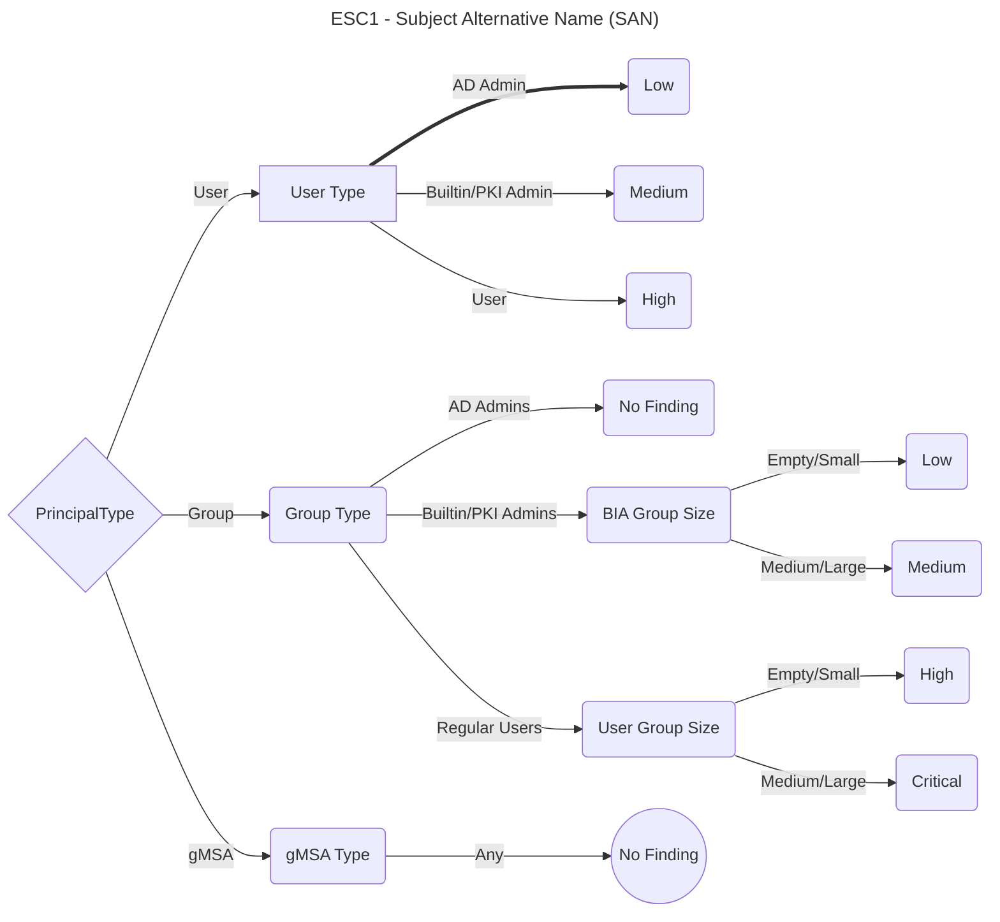

```mermaid
---
title: ESC1 - Subject Alternative Name (SAN)
---
flowchart LR
    PrincipalType{PrincipalType} -->|User| UserType["User Type"];
            UserType == AD Admin ==> ADAUPriority(Low);
            UserType -- Builtin/PKI Admin --> BIAUPriority(Medium);
            UserType -- User --> UserPriority(High);
    PrincipalType -->|Group| GroupType("Group Type");
            GroupType -- AD Admins --> ADASize(No Finding);
            GroupType -- Builtin/PKI Admins --> BIASize(BIA Group Size);
                BIASize -- Empty/Small --> BIAEGPriority(Low);
                BIASize -- Medium/Large --> BIAMGPriority(Medium);
            GroupType -- Regular Users --> UsersSize(User Group Size);
                UsersSize -- Empty/Small --> UsersEGPriority(High);
                UsersSize -- Medium/Large --> UsersMGPriority(Critical);
    PrincipalType -->|gMSA| gMSAType(gMSA Type);
            gMSAType -- Any --> gMSAPriority((No Finding));
```