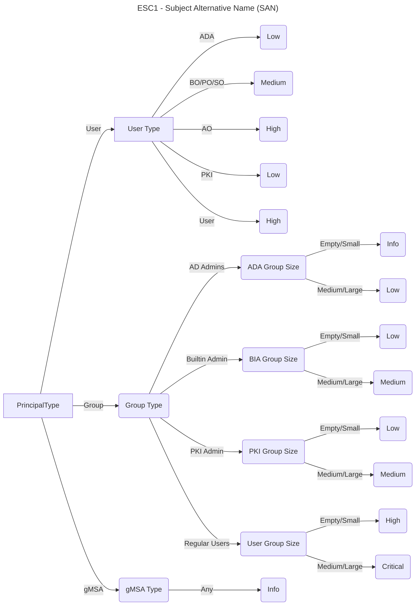

```mermaid
---
title: ESC1 - Subject Alternative Name (SAN)
---
flowchart LR
    PrincipalType -->|User| UserType["User Type"];
            UserType -- ADA --> ADAUPriority(Low);
            UserType -- BO/PO/SO --> BIAUPriority(Medium);
            UserType -- AO --> AOUPriority(High);
            UserType -- PKI --> PKIAUPriority(Low);
            UserType -- User --> UserPriority(High);
    PrincipalType -->|Group| GroupType("Group Type");
            GroupType -- AD Admins --> ADASize(ADA Group Size);
                ADASize -- Empty/Small --> ADAEGPriority(Info);
                ADASize -- Medium/Large --> ADAMGPriority(Low);
            GroupType -- Builtin Admin --> BIASize(BIA Group Size);
                BIASize -- Empty/Small --> BIAEGPriority(Low);
                BIASize -- Medium/Large --> BIAMGPriority(Medium);
            GroupType -- PKI Admin --> PKIASize(PKI Group Size);
                PKIASize -- Empty/Small --> PKIAEGPriority(Low);
                PKIASize -- Medium/Large --> PKIAMGPriority(Medium);
            GroupType -- Regular Users --> UsersSize(User Group Size);
                UsersSize -- Empty/Small --> UsersEGPriority(High);
                UsersSize -- Medium/Large --> UsersMGPriority(Critical);
    PrincipalType -->|gMSA| gMSAType(gMSA Type);
            gMSAType -- Any --> gMSAPriority(Info);
```
