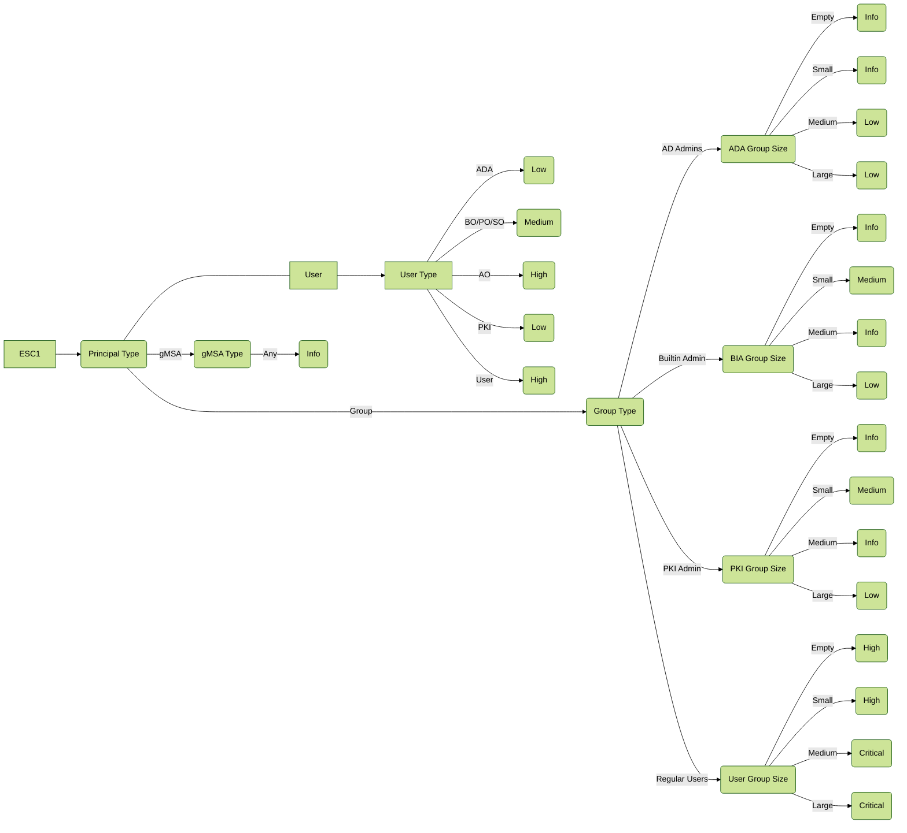

```mermaid
%%{init: {'theme':'forest'}}%%
flowchart LR
    ESC1 --> PrincipalType(Principal Type);
        PrincipalType ---- User --> UserType["User Type"];
            UserType -- ADA --> ADAUPriority(Low);
            UserType -- BO/PO/SO --> BIAUPriority(Medium);
            UserType -- AO --> AOUPriority(High);
            UserType -- PKI --> PKIAUPriority(Low);
            UserType -- User --> UserPriority(High);
    PrincipalType ------>|Group| GroupType("Group Type");
            GroupType -- AD Admins --> ADASize(ADA Group Size);
                ADASize -- Empty --> ADAEGPriority(Info);
                ADASize -- Small --> ADASGPriority(Info);
                ADASize -- Medium --> ADAMGPriority(Low);
                ADASize -- Large --> ADALGPriority(Low);
            GroupType -- Builtin Admin --> BIASize(BIA Group Size);
                BIASize -- Empty --> BIAEGPriority(Info);
                BIASize -- Small --> BIASGPriority(Medium);
                BIASize -- Medium --> BIAMGPriority(Info);
                BIASize -- Large --> BIALGPriority(Low);
            GroupType -- PKI Admin --> PKIASize(PKI Group Size);
                PKIASize -- Empty --> PKIAEGPriority(Info);
                PKIASize -- Small --> PKIASGPriority(Medium);
                PKIASize -- Medium --> PKIAMGPriority(Info);
                PKIASize -- Large --> PKIALGPriority(Low);
            GroupType -- Regular Users --> UsersSize(User Group Size);
                UsersSize -- Empty --> UsersEGPriority(High);
                UsersSize -- Small --> UsersSGPriority(High);
                UsersSize -- Medium --> UsersMGPriority(Critical);
                UsersSize -- Large --> UsersLGPriority(Critical);
    PrincipalType -- gMSA --> gMSAType(gMSA Type);
            gMSAType -- Any --> gMSAPriority(Info);
```
