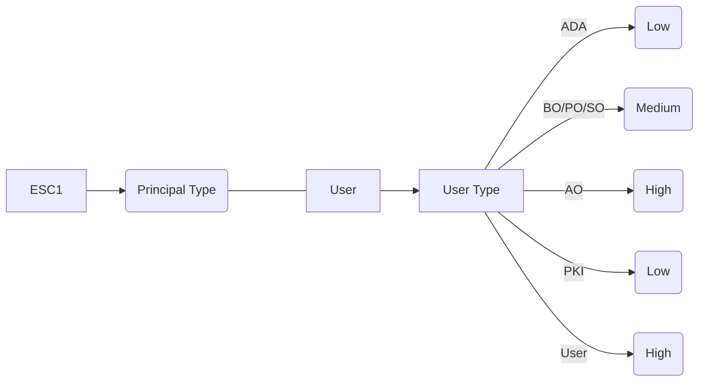

```mermaid
flowchart LR
    ESC1 --> PrincipalType(Principal Type);
        PrincipalType ---- User --> UserType["User Type"];
            UserType -- ADA --> ADAUPriority(Low);
            UserType -- BO/PO/SO --> BIAUPriority(Medium);
            UserType -- AO --> AOUPriority(High);
            UserType -- PKI --> PKIAUPriority(Low);
            UserType -- User --> UserPriority(High);
```
