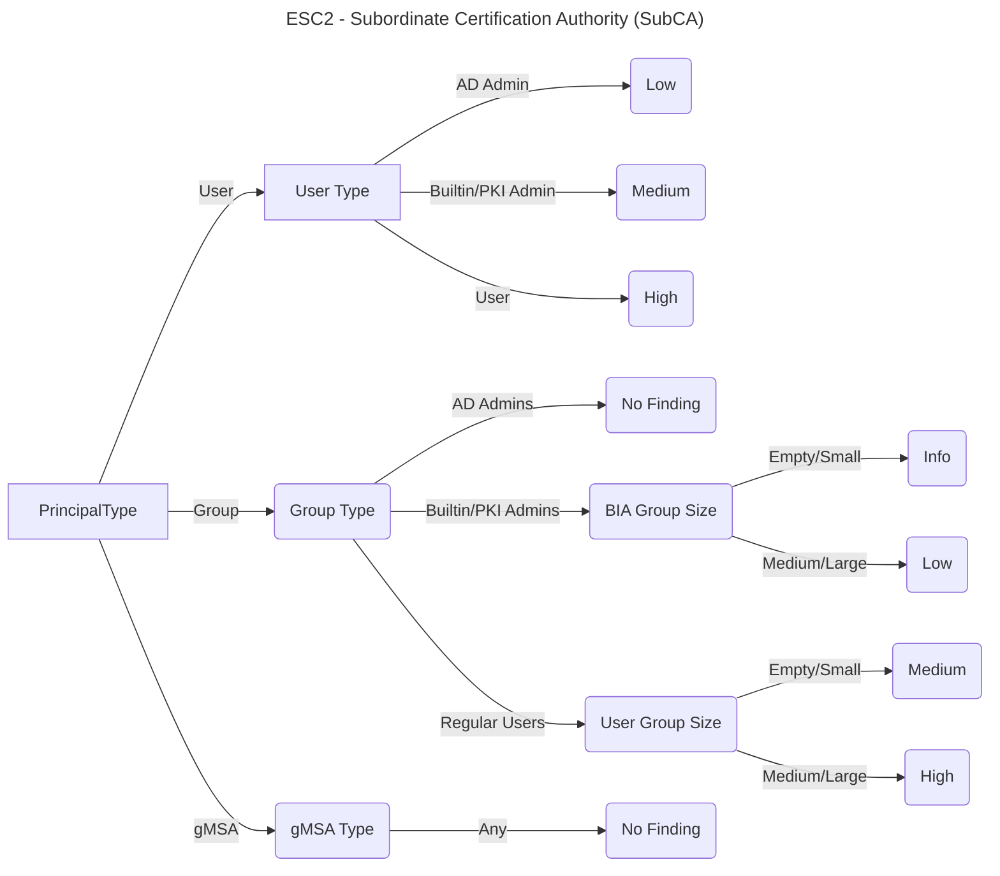

```mermaid
---
title: ESC2 - Subordinate Certification Authority (SubCA)
---
flowchart LR
    PrincipalType -->|User| UserType["User Type"];
            UserType -- AD Admin --> ADAUPriority(Low);
            UserType -- Builtin/PKI Admin --> BIAUPriority(Medium);
            UserType -- User --> UserPriority(High);
    PrincipalType -->|Group| GroupType("Group Type");
            GroupType -- AD Admins --> ADASize(No Finding);
            GroupType -- Builtin/PKI Admins --> BIASize(BIA Group Size);
                BIASize -- Empty/Small --> BIAEGPriority(Info);
                BIASize -- Medium/Large --> BIAMGPriority(Low);
            GroupType -- Regular Users --> UsersSize(User Group Size);
                UsersSize -- Empty/Small --> UsersEGPriority(Medium);
                UsersSize -- Medium/Large --> UsersMGPriority(High);
    PrincipalType -->|gMSA| gMSAType(gMSA Type);
            gMSAType -- Any --> gMSAPriority(No Finding);
```