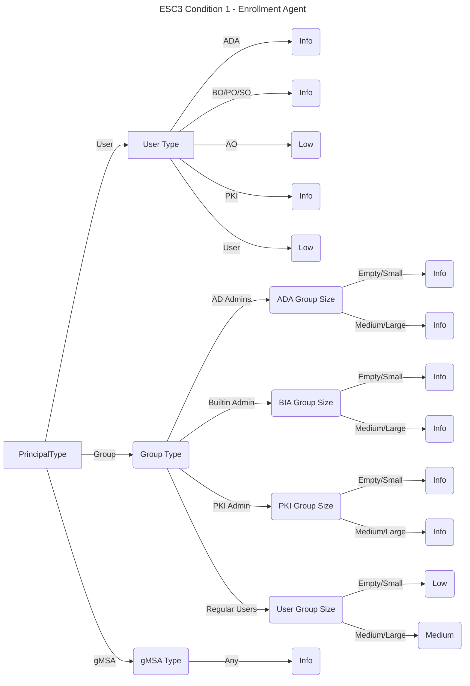

```mermaid
---
title: ESC3 Condition 1 - Enrollment Agent 
---
flowchart LR
    PrincipalType -->|User| UserType["User Type"];
            UserType -- ADA --> ADAUPriority(Info);
            UserType -- BO/PO/SO --> BIAUPriority(Info);
            UserType -- AO --> AOUPriority(Low);
            UserType -- PKI --> PKIAUPriority(Info);
            UserType -- User --> UserPriority(Low);
    PrincipalType -->|Group| GroupType("Group Type");
            GroupType -- AD Admins --> ADASize(ADA Group Size);
                ADASize -- Empty/Small --> ADAEGPriority(Info);
                ADASize -- Medium/Large --> ADAMGPriority(Info);
            GroupType -- Builtin Admin --> BIASize(BIA Group Size);
                BIASize -- Empty/Small --> BIAEGPriority(Info);
                BIASize -- Medium/Large --> BIAMGPriority(Info);
            GroupType -- PKI Admin --> PKIASize(PKI Group Size);
                PKIASize -- Empty/Small --> PKIAEGPriority(Info);
                PKIASize -- Medium/Large --> PKIAMGPriority(Info);
            GroupType -- Regular Users --> UsersSize(User Group Size);
                UsersSize -- Empty/Small --> UsersEGPriority(Low);
                UsersSize -- Medium/Large --> UsersMGPriority(Medium);
    PrincipalType -->|gMSA| gMSAType(gMSA Type);
            gMSAType -- Any --> gMSAPriority(Info);
```